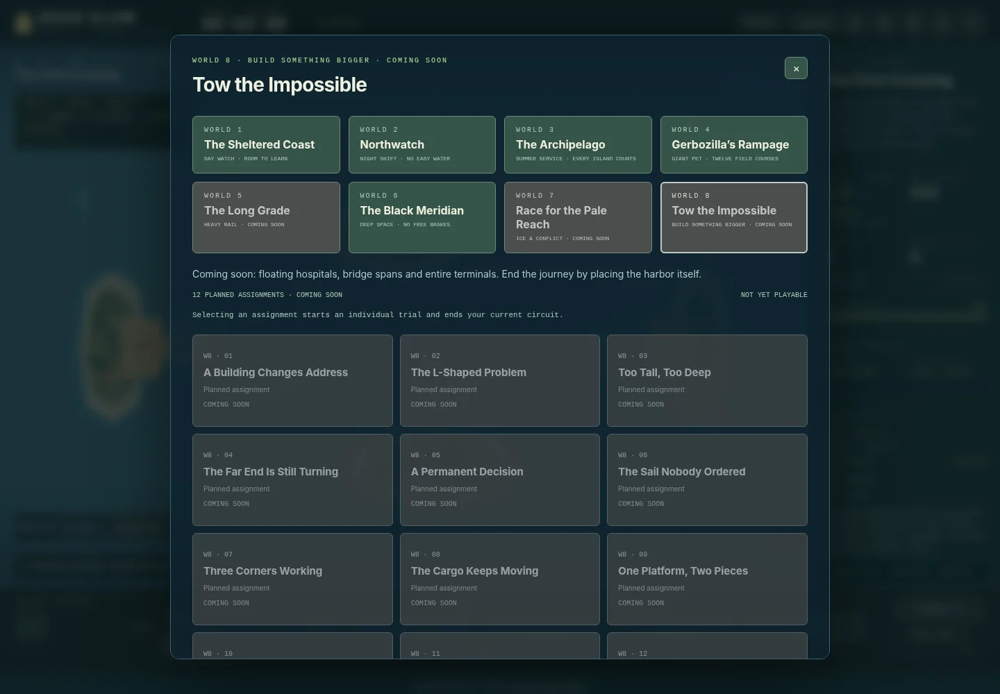
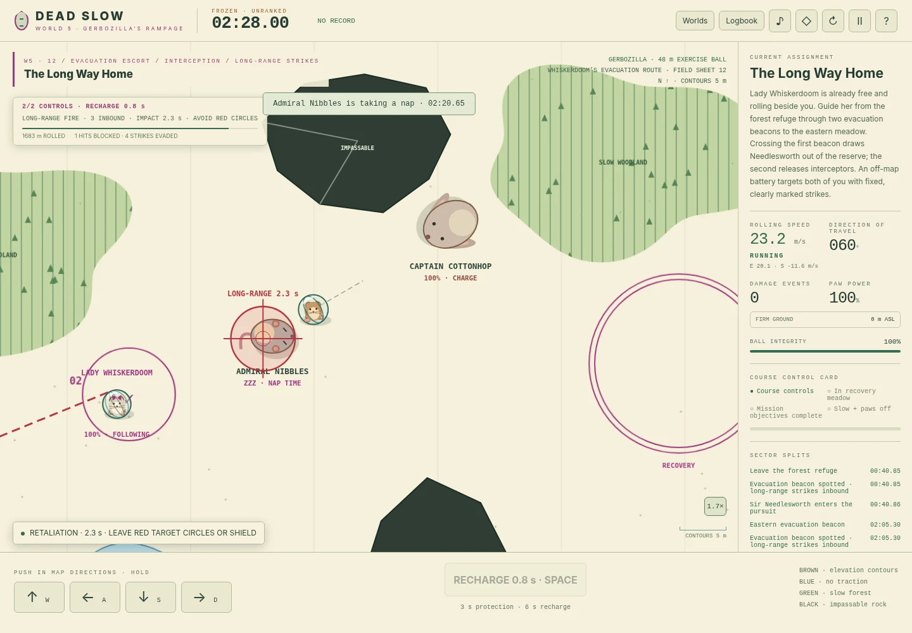

# DEAD SLOW — Harbor Trials

**Play online: [lumipakkanen.com/dead-slow](https://lumipakkanen.com/dead-slow/).**
Report [bugs and feature requests](https://github.com/frostburn/dead-slow/issues/).

**Neutral is not a brake.** A top-down ship-handling game about arriving slowly,
with enough room left to stop—at sea, in vacuum, inside a giant hamster ball, or along a freight railway.
Version 6 has seventy-two circuit stages across six playable worlds in an eight-world atlas, a separate Century Ship bonus, local speedrun
records, personal-best ghosts, keyboard controls and a multitouch helm.

## The eight-world atlas

| World | Campaign | Availability |
| --- | --- | --- |
| 1 | The Sheltered Coast | 12 playable stages |
| 2 | Northwatch | 12 playable stages |
| 3 | The Archipelago | 12 playable stages |
| 4 | Gerbozilla’s Rampage | 12 playable courses |
| 5 | The Long Grade | 12 playable assignments |
| 6 | The Black Meridian | 12 playable sectors + the Century Ship bonus |
| 7 | Race for the Pale Reach | Coming soon — 12 named placeholders |
| 8 | Tow the Impossible | Coming soon — 12 named placeholders |

Gray chapters can be inspected but not launched. The 24 placeholder missions
are not counted as playable levels or included in circuits. The Grand Tour visits
**1 → 2 → 3 → 4 → 5 → 6**, seventy-two assignments; the Century Ship remains separate.
There are **73 playable assignments and 41 author recordings**. Every complete world has its own twelve-stage circuit.

World 5 starts with collecting two quarry wagons, then a station run-around, then a heavy descent with a gentler branch and cooling loop. W/S changes power, A/D the train brake, Q/E the locomotive brake, X reverses at rest, F couples, and B sets or releases the selected cut’s handbrakes. Click a link in the train strip to uncouple. Point buttons lock while occupied. The map shows the head and tail; the strip shows each wagon’s grade. Enter `DeadSlow.watch("long-grade-1", 8)` in the browser console to watch the tutorial recording. `DeadSlow.normal()` starts a fresh attempt at normal speed. See [rail engine notes](docs/RAILWAY.md) for architecture and validation.

Watch the transformer shuttle with `DeadSlow.watch("long-grade-7", 16)`.
The cargo assignment now requires pulling the complete vessel into a headshunt,
changing the export points and reversing into the berth. Head/tail follow the
selected driving end; negative speed means rollback. Schema 15 archives earlier
bridge and cargo records before applying the revised constraints.

The next five assignments add an opposing passenger service at Rook’s Hollow,
two opportunities to intercept runaway wagons, a slippery wooded saddle,
transformer shuttles across a weight-limited bridge, and an oversized vessel
with a visible swept-clearance preview. The emergency gravel catch is a valid,
non-clean rescue. Passenger schedules, bridge occupancy and wheel sliding are
shown during play. The final four assignments add a rear helper, balanced train-ferry loading, a flood evacuation and the winter-supply journey to the coast. In helper missions, E / Q raises / lowers rear assistance in place of the locomotive brake. Press H or Signal departure to release passenger trains; set their junctions before they can pass. Watch the complete finale with `DeadSlow.watch("long-grade-12", 16)`.

Volcanoes now have real slopes: an unpowered ball rolls away from their summits. The visible apron and the physical hill have the same footprint. Earlier volcanic courses, railway layouts and circuits remain archived in the logbook.

**Window focus pausing is optional.** In Logbook & settings, turn off
“Pause when window loses focus” to keep playing a ranked run while using
another window. Held controls are released on focus loss. Hidden tabs and
manual pauses still pause the game and mark the attempt as practice.

**Restart immediately with Shift+R or a retry button.** Plain R does nothing.
There is no confirmation or intervening pause. Restarting retains completed
circuit stages and charges the attempted-stage time without marking a ranked
circuit as practice. Saved records are never deleted.

Campaign place and vessel names are fictional; see [the naming ledger](docs/FICTIONAL_NAMES.md).
Real software credits, project URLs and license attribution are unchanged.



### New volcanic crossings and records

Muesli Furnace cuts across the caldera approach in **It All Goes Downhill**.
**The Black Boulder Wood** has two fissures with independent clocks.
**Strictly No Petting** adds steam eruptions at Bristle Brook crossings: watch
the river and the hedgehog, then commit to a crossing with enough momentum.


Orange outlines identify geothermal danger zones. A vent cycles through quiet,
amber warning, then eruption; countdowns use the same fixed simulation clock as
collisions. Quiet footprints are traversable. Lava and steam burn the whole ball
footprint while active, and shields protect only for their normal three seconds.
These hazards do not add gravity, alter water traction or change the rolling model.

Schema 13 archives records/ghosts for the three revised courses separately. The
previous Gerbozilla championship and earlier Grand Tour order retain overall and
clean archives. Every other stage and the sea/space circuit records remain active.
Display renaming does not change mission or vessel IDs used by saved data.

## World 4 — Gerbozilla’s Rampage

**Twelve courses and a complete championship.** Gerbozilla treads a 48-metre exercise ball across
orienteering-style field maps. Hold **WASD / arrows** to push in map directions;
counter-push early to brake. **Space / F** gives three seconds of shielding,
then six seconds recharging. Shields stop damage, not momentum or solid rock.



| Course | Challenge | Clean reference |
| --- | --- | ---: |
| A Small Problem in Seedhaven | Ridge, crooked lake and a small redirection: the introduction. | 100.258 s |
| Banks for the Memories | Closed mountain-ring citadels. Carry speed into and out of the bowls. | 95.008 s |
| No Grip, No Problem | Three water-moat islands. Each demolition launches three long-range strikes. | 174.258 s |
| It All Goes Downhill | Time a volcanic lava channel, retain crossing speed, then ram the caldera core. | 115.758 s |
| The Black Boulder Wood | Five controls through woodland and two independently erupting volcanic fissures. | 201.758 s |
| Fort Pillow | A double moat, steep mountain ring, retaliation and northern satellite fort. | 168.508 s |
| A Very Territorial Guinea Pig | Cavyclasm commits to a telegraphed charge, then needs a rest. Time shielded rams. | 151.758 s |
| Pepperbreath at Marshmallow Keep | Collect a pepper and aim finite bursts over low walls. Armor resists ordinary ramming. | 341.758 s |
| Nobody Puts Whiskerdoom in a Cage | Defeat a rabbit sentry, smash two locks, greet Lady Whiskerdoom and escort her home. | 456.492 s |
| Strictly No Petting | Cross two timed steam vents at the river and avoid invulnerable Sir Needlesworth. | 304.258 s |
| A Hedge Against Disaster | Time shields during pursuit; escape through a real size-limited rock notch. | 89.508 s |
| The Long Way Home | Lady starts free. Intercept pursuers and guide her clear of off-map strikes; both must reach home. | 257.975 s |

**Field-map symbols affect play.** Brown contours describe the elevation field
used by gravity. Green woodland adds rolling resistance; lighter clearings offer
faster routes. Black boulder silhouettes are impassable, including under shields.
Blue water removes paw traction, not downhill gravity or existing momentum.
The same outlines drive rendering, forest/water queries and rock collisions.

The Reservoir Hairpin has been replaced by the control-only woodland course.
Pet combat,
fire and rescue add different objectives rather than another sequence of cities.
Enemies are enlarged guinea pigs and rabbits. They have mass, inertia, health,
committed charge directions and recovery periods; impacts transfer momentum and
deal mutual damage. A shield protects Gerbozilla, not the other animal.
Defeated mortal pets take a nap and stop attacking. **Sir Needlesworth cannot
be damaged** by rams or terrain. His health is not an objective: evade his
locked charge or shield an impact, which still transfers momentum.

On the pepper course, **hold H** or the **BREATH** touch button. The flame points
in your last push direction, not necessarily your velocity. It reaches over low
walls but cannot pass through giant boulders. Three seconds of breath recharge
only while released; immersion suppresses fire. The keep's armored cores cannot
be bypassed by ordinary ramming.

Lady Whiskerdoom has her own ball, inertia and shell integrity. Open both cage
locks, approach to greet her, then lead her through the woods and clearings. She
follows your travelled route rather than teleporting through obstacles. Leave
braking room and bring **both** hamsters into the recovery meadow. Your shield
does not protect her; a clean rescue means neither hamster takes damage.

**The finale does not recapture her.** Lady Whiskerdoom begins free beside you.
Two route beacons release Needlesworth and two mortal interceptors; the latter
aim at her rather than automatically chasing Gerbozilla. Marked artillery
alternates between both hamsters, locks its predicted impact point ten seconds
before landing, and can damage either. Your shield cannot shield her. Defeating
pursuers is optional; a safe route and well-timed interceptions are what matter.
There is no cage, jailbreak, survival timer, or second capture.

Course 3 and Fort Pillow retain their long-range retaliation: red blast marks
lock 7.5 seconds before impact. They do not home, and recovery waits until queued
strikes resolve. Keep moving, redirect after lock or shield at impact.

The dry wheel has discrete rubber-bearing creaks with a faint **inharmonic shell
resonance**, broad filters and little pitch bends. Strokes retain silent gaps and
follow rotation. Water's accepted quiet, high-pitched chirps are unchanged.
The hind paws still tread behind the belly. Fire has a soft filtered hiss.

```js
DeadSlow.watch("gerbo-prickly-business", 8)
DeadSlow.watch("gerbo-rolling-threat", 8)
DeadSlow.watch("gerbo-long-way-home", 8)
```

Run one at a time. All twelve courses have input-only reference recordings; the
ten revised-map recordings are verified for version 5.0.0. They are not
claimed optimal. Read the [field guide](docs/GERBOZILLA.md) for mechanics and tests.

There are **41 recordings and 73 selectable assignments**. All six playable worlds
have twelve-stage circuits; the **Grand Tour has 72 stages**. The Century Ship
is the single bonus, excluded from every circuit. Each route has separate
overall and clean records. The World 4 HUD, result screen and field log show
the circuit clock and records, including failed-attempt time and retries.

The field atlas adds Clover Copse and lowland pines to the citadels, alder woods
to the lake district, a broken Mount Muesli crest, and an asymmetric Fort Pillow
rim. Bramble Tarn sits within the forest; Birch Pool has its own hillside.
Cavyclasm's arena has rolling ground, and the Keep has Sugar Pond and Cocoa Pool.
**Strictly No Petting** crosses meandering Bristle Brook in both directions.
**A Hedge Against Disaster** now has a faster, closer pursuit: the 89.508-second
clean reference blocks three actual hits. Hard spine impacts in this pursuit are fatal without protection: omitting any one
of the three reference shields breaks the ball. There is no shield-count
completion condition and no claim of global time optimality.

Schema 10 preserves the earlier **48-stage Grand Tour** separately. Records,
ghosts and splits for revised preview field maps are archived under their own
keys; earlier terrain archives remain intact. Seedhaven, The Long Way Home and
all sea/space course records remain active. Export before moving HTML files.

## Accelerated playtest

```js
DeadSlow.tour(8)          // Start the 72-stage Grand Tour as manual 8× practice.
DeadSlow.circuit(3, 8)    // Or play a single world's circuit.
DeadSlow.progress()      // Mission, total clock, retries and completed splits.
```

The console commands unlock an on-chart speed selector and Freeze button. Use
`[` / `]` to slow down/speed up, and backslash to freeze/resume. Rate survives
retries and stage changes; returning to 1× never makes an assisted circuit ranked.
`DeadSlow.normal()` returns to a fresh ranked individual trial. See the
[playtest guide and course audit](docs/PLAYTEST.md) for test scope and record migration.

## Play

Open **`dist/index.html`** from the release archive in a browser. The game is one
self-contained HTML file: no downloads, accounts, server, tracking or external
assets. Some mobile file managers show HTML as a preview rather than opening a
browser; a static web host or the local server below avoids that restriction.

For source development, use Node.js 22 or newer:

```sh
npm ci --ignore-scripts
npm run build
npm run serve
```

Open `http://127.0.0.1:8080` for the source version, or
`http://127.0.0.1:8080/dist/` for the standalone build. No npm packages are needed
for the game, build, server or Node tests. `npm ci --ignore-scripts` installs
the pinned TypeScript checker used by `npm run check`; it is development-only. Set `PORT` to change the local port; set
`HOST=0.0.0.0` only when intentionally exposing the server to your local network.

## Other playable campaigns

**World 1 — The Sheltered Coast.** Twelve daylight harbor trials teach braking,
berth alignment, gates, crossing traffic, locks, reverse parking, loading,
tides and no-wake approaches. The current-heavy destinations have marked lee
water and solid wavebreaks. Shelter reduces the water's influence, not the
ship's existing momentum.

**World 2 — Northwatch.** Twelve industrial night-watch challenges: exposed
cross-current berths, a pulsing sluice, double booms, narrower lock approaches,
a heavier hull and a combined harbor examination.

**World 3 — The Archipelago.** A fictional Nordic-inspired island service in a
long summer evening. Granite skerries, pines, red timber cottages, yellow
vehicle ferries and a red working tug. You operate **MS Linvara** or **MT Sivra**.

| Stage | Island work |
| --- | --- |
| The First Crossing | Board four vehicles, cross the sound, unload. |
| A Bigger Boat | Tow a 56-metre yacht with a much smaller tug. |
| The Milk Run | Deliver one manifest to two separate island ramps. |
| The Floating Sauna | Move a broad sauna pontoon around a wooded skerry. |
| Market Day | Carry a full deck through no-wake water and crossing pleasure boats. |
| The Granite Needle | Swing a north-facing, broadside work barge into line before towing through the granite passage. |
| The Last Bus Home | Board a bus, cars and a van; catch a swing-bridge window. |
| Slack Water Salvage | Tow a coastal packet through a pulsing cross-set into shelter. |
| Island Exchange | Unload two, board two, then take the changing manifest home. |
| One Line, Two Calls | Recover a yacht and a fishing boat in dispatch order. |
| Cars and a Casualty | Complete ferry duty, then use the empty ferry for a rescue. |
| Midsummer Dispatch | Five vehicles, two village calls, clearance, a bridge and a tow. |

The archipelago has **open water on all four sides**, without a perimeter
seawall. Every Coast and Northwatch harbor has an open western approach. The
chart remains the assignment area: crossing its edge with any part of your
hull or a casualty ends the attempt. A small warning appears only within 30
metres of an open edge; there is no invisible wall to bounce off.

After the two island tutorials, ferries start empty in the fairway and must
reach their first ramp; tugs start outside line-passing range and must approach
the casualty. The positioning leg is part of the clock, not skipped setup.

Every stage is selectable immediately. World circuits each cover twelve stages;
the **Grand Tour** visits all seventy-two non-bonus stages. Each route has its own record table.


## World 6 — The Black Meridian

**Cutting thrust is not braking.** Spacecraft use a separate, drag-free simulation.
Main engines, lateral jets and rotational jets share a finite propellant budget.
Releasing the rotational jets leaves you spinning; opposite jets must remove the
spin. Match the **relative velocity** of moving capture cradles, then cut every
jet for the two-second docking hold.

The twelve assignments include a moving asteroid's survey platform, a compulsory
rendezvous with a fuel tanker, docking two tenders to a mothership and flying the
heavier assembly, stationary and moving-target gunnery with real projectile flight
and recoil, equal-and-opposite rescue beams, drifting radiation shields, solar-only
propulsion, and a collision with your own recorded past. **Cold Transit** adds an
unpowered scanner corridor with moving drones; **Perihelion Dispatch** combines
fuel, rescue and migrating shadow cover.

**The Century Ship** is a thirteenth, optional sector, outside every marathon.
Its 110.592-km compressed interstellar route still takes more than thirty simulated
minutes, including the most generous combined main/lateral acceleration bound.
The rogue planet **Erebune** blocks a straight coast. Build lateral clearance, pass
the limb and return to the destination line. An eight-command clean reference
flight takes **32:02.33**. There is no waiting timer; surface impact ends the flight.
These are planar local-frame puzzles, not an orbital or relativistic simulator;
star-system distances are deliberately compressed.

**Nothing to Push Against** now teaches an offset approach while two rocks drift
out of the sector on straight, non-repeating trajectories. In **The Safe Side of
a Stone**, persistent radiation makes early arrival dangerous: ride Haven’s shadow
until it sweeps the survey marker and the station. The flight computer forecasts
approximate cradle-cover times from actual geometry, not an objective timer.

**Yesterday Has Right of Way** takes place inside **Janara Station**. Navigate the
freight stacks, capture gates A and B, and escape while two solid versions of your
own earlier flights recur in the same concourse. Both insertion destinations are
marked; passing bays provide space to yield instead of colliding with history.

All **thirteen** space missions have clean, fixed-input author recordings. Try:

```js
DeadSlow.watch("family-reunion", 16)
DeadSlow.watch("moving-argument", 8)
DeadSlow.watch("equal-and-opposite", 16)
DeadSlow.watch("yesterday", 16)
DeadSlow.watch("century-ship", 32)
```

Run one at a time. `DeadSlow.speed(0)` freezes a replay; `DeadSlow.step(30)` advances
it without changing the 120 Hz physics. Assisted flights stay out of normal
records. See the [flight and mission guide](docs/SPACE.md) for mechanics, controls,
verified times and the Century Ship's lower-bound argument.

## At the helm

| Control | Action |
| --- | --- |
| W / S or Up / Down | Move engine telegraph one notch ahead / astern. |
| A / D or Left / Right | Hold port / starboard rudder. |
| Q / E | Hold bow thruster to port / starboard. |
| Space | Order neutral. This does not stop the ship. |
| F | Make fast to the current rescue target, or cast off. |
| J / K | Hold to reel in / pay out the towline. |
| Shift+R | Retry immediately. |
| Escape | Pause / return. Pausing makes the attempt unranked. |
| Z | Cycle chart zoom. |
| G / V / M / H | Toggle ghost / coast guide / audio; horn at sea, radar pulse in space. |

Buttons provide the same controls on touchscreens. Rudder, thruster and winch
can be held simultaneously; cancelling a touch releases its command. The
telegraph stays at its selected notch.

The speedometer reports signed **ground motion**, not engine direction. AHEAD
can remain positive while the propeller is reversing. ASTERN is negative;
ABEAM identifies almost purely sideways motion. The drift instrument separates
port and starboard motion. LOCAL SET reports the current along your own hull.

### Space controls

W/S change persistent fore/aft thrust. Space cuts main thrust. Hold A/D to apply
rotation and Q/E for pure sideways translation. Counterfire to stop each motion.
For rescue jobs, F locks/releases the beam, J attracts and K repels. Both craft
feel the opposite force. Space HUD speeds are **m/s**, not knots; fuel is a
reference-mass impulse budget, shared across jets and beams. Keyboard and touch
controls can be held simultaneously. In space, **H** sends a visual radar pulse
and electronic ping; the **◎** chart button works on touchscreens. Coasting is
quiet, while actual main, lateral, rotational and beam firing has distinct
onboard feedback. **M** mutes audio without hiding the pulse.

### Ferry calls

Fit the entire hull inside the **amber** loading or unloading outline, face its
arrow, slow below approximately **0.4 knots**, and order neutral. After a short
settle hold the ramp opens; vehicles cross one at a time and visibly occupy the
deck. Cars, vans and buses contribute different masses, changing acceleration
and stopping distance. Wait for the ramp to close before departing.

There is no loading button. Ordering thrust interrupts loading, closes the ramp
and preserves vehicles already transferred. Return to the same slip to finish
that call without duplicating or losing its manifest. The engine and thruster
are interlocked while the ramp is down; existing drift is not erased.

### Towing

Place your **stern** within **44 metres of the casualty's bow**, with less than
approximately **1.6 knots** relative attachment-point speed and a clear line
between both towing points. Press F. The casualty leaves its anchor only when
you make fast.

The line pulls but cannot push. Both hulls have their own momentum, rotation,
draft and local water sample. J/K adjust line length between **12 and 64 metres**.
Load is displayed as a percentage of the line's configured working strength,
not as a calibrated real-world force. Sustained overload or dragging the line
across rock can part it. Reconnect to recover the job; a parted line loses the
clean-run category, but does not add a hidden time penalty.

A disabled boat continues coasting when released. Bring its *entire hull* into
its own rescue berth, aligned and slow, for two uninterrupted seconds. Shore
crew then secure it and release your line. **You still have to dock your own
vessel.** Other casualties wait at anchor until their turn; there is no hidden
rescue countdown. Delivered boats remain solid obstacles.

### Finish and race

Complete all clearance and service jobs. Fit your own hull inside the final
**green** berth, face the arrow, slow below its stage-specific limit, reduce yaw,
order neutral, let engine output drop below 15%, and hold for two seconds. In
space, match the cradle's velocity, keep relative spin below 0.012 rad/s and
cut all jets (main output below 2%). Each world has a twelve-stage circuit; the
Grand Tour has 72 stages. The Century Ship never enters either route.

The clock is fixed-step **in-game time (120 Hz)**. Gates, traffic, tides and
current pulses reset to identical phases on retry. Circuit clocks retain failed
attempts and retries, but exclude between-stage menus. Pausing, opening a menu
mid-run, losing focus or a long rendering interruption marks the run as practice.

The logbook retains ten overall times and ten clean times per stage/route (with
overlap removed). A clean run has no contacts, wake violations, groundings or
parted lines. Contacts to towed vessels count too. Your own vessel's fastest
ranked run supplies the personal-best ghost and split comparisons; a ghost is
not a full tow-formation replay. Medals are authored pace targets, not claims of
optimal play. The twelve-second neutral-coast guide includes an attached tow,
but not future collisions or traffic avoidance.

## Save data and upgrades

Records live in browser-local storage and are not an online or tamper-proof
leaderboard. Export the logbook before moving between files, browsers or hosts;
then import it through **Logbook**. Import replaces the current local logbook.
Storage denial or quota failure leaves the session playable and exportable.

Logbooks using schemas 1–18 are accepted. Schema 18 adds independent course/rules compatibility; this architecture update retains current records. Schema 17 archives the earlier routes for 5-04, 5-09 and 5-12 and their railway and Grand Tour circuits. Schema 16 archives the courses before volcanic hills, their World 4 circuit and the earlier 60-stage Grand Tour. Schema 13 archives the three pre-volcano
field routes, the corresponding Gerbozilla circuit, and the earlier Grand Tour
order. Other individual stages remain comparable after the display renumbering.
Schema 12 separately archives the
earlier Backwater and Island Exchange approaches, plus their World 2, World 3
and Grand Tour circuits. Their clean and overall records remain visible.
Schema 11 archives the inline Granite
Needle and the earlier Whiskerdoom lake layout, with their ghosts and splits.
Their World 3, World 4 and 60-stage Grand Tour records remain separately available
in the logbooks and exports. Other stage and circuit records remain active.
 Earlier migrations archive the retired Reservoir
Hairpin; schema 8 retains superseded Banking/Lake District routes separately. Schema 6 archives old records, ghosts and
splits for the five redesigned missions (`vacuum`, `umbra`, `perihelion-dispatch`,
`yesterday`, `century-ship`), plus their affected Meridian and Grand Tour circuits.
These are not comparable routes. Unchanged stages and circuits retain active records. Archives remain visible in the logbook and exports.
The earlier **36-stage Grand Tour** also remains separate from the current 72-stage route.

Older schema migrations still preserve dock-side island departure records and
24-stage circuits in their existing archives; none are deleted. The logbook
shows archived circuit times, and full archived data remains in exports.
The same storage key is retained for same-origin upgrades. Renaming a local HTML file may create a separate storage origin in
some browsers, so export/import is the reliable transfer path.

## Repository layout

```text
index.html                 Source page; loads modules directly
style.css                  Responsive controls, dialogs, five playable palettes and three gray future chapters
src/
  space-audio.js           Ion-drive, reaction jets and electronic flight cues
  physics.js               Hulls, forces, collisions, water, tide, tow constraint
  navigation.js            Shared open-edge collision, containment and warnings
  archipelago.js           Twelve island-service level definitions
  levels.js                Eight-world atlas; playable catalog and disabled future plans
  space-levels.js          Twelve spacecraft assignments and Century Ship bonus
  space.js                 Vacuum, ephemerides, beams, cannon, solar and time travel
  space-renderer.js        Star charts, spacecraft, rays, shadows and intercepts
  space-ui.js              Space instruments, controls and marine-label restoration
  jobs.js                  Manifest, ramp, towline and rescue state machines
  storage.js               Records, ghosts, validation and migrations
  renderer.js              Procedural Canvas chart and vessels
  audio.js                 Procedural Web Audio engine and signals
  verification.js          Generated, checked-in control recordings for offline replay
  console.js               Secret chart room, time controls and verification playback
  game.js                  Fixed-step orchestration, rules, input and UI
 tools/                    Offline builder, local server and trajectory verifier
 tests/                    Node tests, browser checks, fixed-input fixtures
 docs/                     Architecture, level design and testing notes
 .github/                  CI, optional Pages deployment and contribution forms
 dist/index.html           Generated offline game (included in release archives)
```

Edit `src`, `index.html` and `style.css`, not `dist/index.html`. The generated
bundle is ignored by git and rebuilt by the deployment workflow.

Railway terrain contours and river bridges are precomputed by `npm run build`.
After changing railway surveys, also commit the regenerated `src/rail-scenery.js`.
`npm run check` rejects stale scenery; the browser never runs terrain interpolation.

## Checks

```sh
npm run check              # Parse JS, validate levels, check types and reproducible bundling
npm run build
npm test                   # Physics, jobs, records, control replays and local server
npm run verify:runs        # All published author runs, using timed inputs only
```

Browser checks are optional development dependencies, separate from playing:

```sh
python -m venv .venv
# Activate the virtual environment for your operating system.
python -m pip install -r requirements-dev.txt
python -m playwright install chromium
python tests/browser_smoke.py --inline --report reports/browser.json
```

With the local server already running, use
`python tests/browser_smoke.py --url http://127.0.0.1:8080/dist/` to test HTTP
navigation and real local storage instead. `--inline` is for restricted test
environments and uses an in-memory storage shim. See [testing notes](docs/TESTING.md)
for coverage, limitations and reproducible trajectory details.

## The secret chart room

The browser console welcomes curious captains. Type `DeadSlow.help()` for
level jumps, 0–32× time, frozen stepping, helm overrides, warping and the actual
verification recordings. `DeadSlow.runs()` lists the available clean,
control-only recordings. Try `DeadSlow.watch("dogleg", 8)` for a turning approach,
`DeadSlow.watch("granite-needle", 16)` for the heavy barge, or
`DeadSlow.watch("island-exchange", 16)` for the ferry return service.
`DeadSlow.verify("all")` measures every published reference run.
`DeadSlow.times()` keeps their author times separate from unverified medal
pace targets. Assisted runs cannot replace normal records; `DeadSlow.normal()`
starts fresh at normal speed. Every space stage, including the bonus, is covered.
See the [console guide](docs/CONSOLE.md).

## Push and publish

For an existing checkout, apply the release patch on a new branch, run the
checks, commit and push that branch for review. The full release archive has no
embedded `.git` or credentials; do not overwrite an existing checkout's history.
To start a separate repository from the archive instead:

```sh
git init -b main
git add .
git commit -m "Add Dead Slow harbor and archipelago trials"
```

Create an empty GitHub repository, add its remote, and push `main`. The
**Checks** workflow runs on pushes and pull requests. It includes Node tests on
22 and 24, plus Chromium browser checks. These workflow files are supplied as
configuration; a local test run is not a claim that remote CI has already run.

For optional hosting, choose **Settings → Pages → Source: GitHub Actions**,
then run **Actions → Deploy Pages → Run workflow**. This is a manual, opt-in
workflow; it publishes only `dist/`. There are no hard-coded account names,
base paths, external services or custom secrets. Future deployments are manual
unless you deliberately add a push trigger. Action versions and Pages permissions
follow the official [upload](https://github.com/actions/upload-pages-artifact)
and [deployment](https://github.com/actions/deploy-pages) documentation.

## Design notes and license

This is a tuned planar simulation, not a calibrated maritime trainer. Masses,
windage, propulsion and drag are relative gameplay units; distances and speeds
use a consistent chart scale. There is no roll, heave, flooding model, rope
wrapping around obstacles or simulated driving ashore. Shore mooring and ramp
operations are abstracted; navigation and braking are not automated.

All scenery is procedural Canvas drawing. Audio is synthesized with Web Audio;
no external image, sound or font assets are bundled. Code and procedural artwork
are under the [MIT license](LICENSE). See [CONTRIBUTING.md](CONTRIBUTING.md),
[architecture](docs/ARCHITECTURE.md) and [level design](docs/LEVEL_DESIGN.md).
