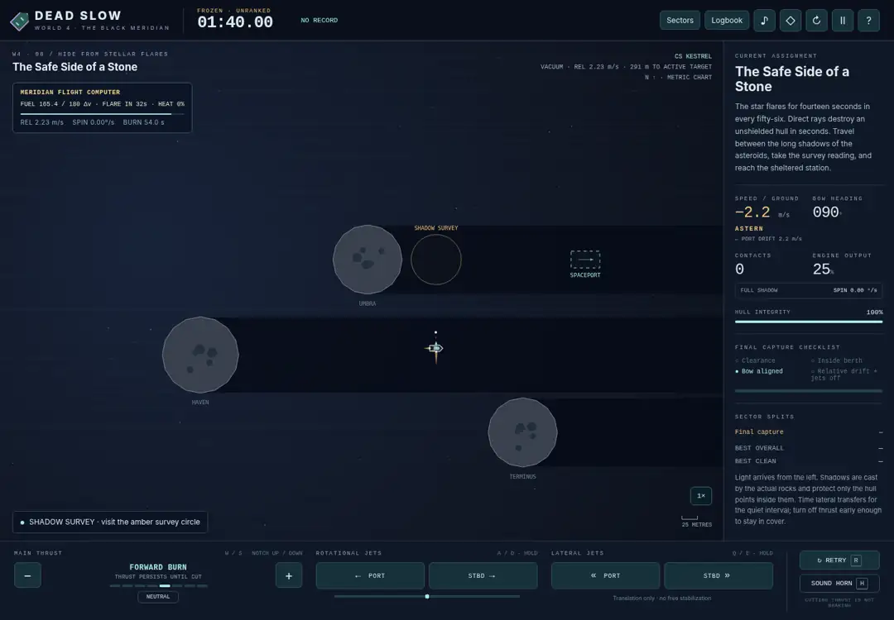
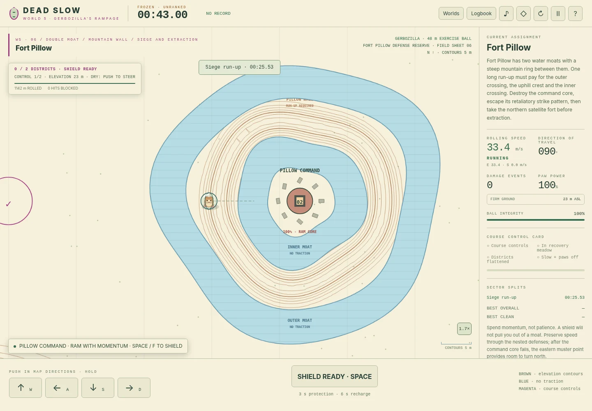
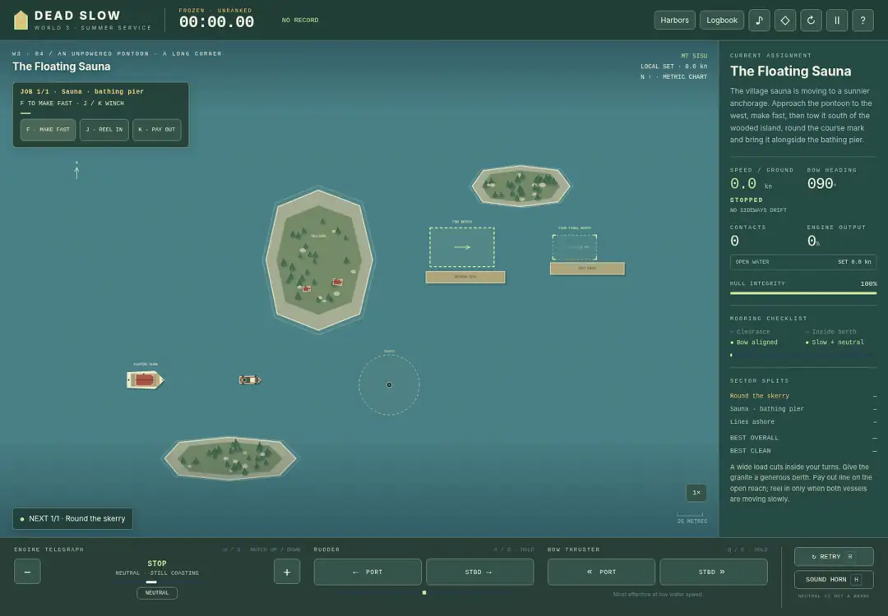

# DEAD SLOW — Harbor Trials

**Neutral is not a brake.** A top-down ship-handling game about arriving slowly,
with enough room left to stop—at sea or in vacuum. Forty-eight circuit stages
across four worlds, a separate Century Ship bonus, local speedrun
records, personal-best ghosts, keyboard controls and a multitouch helm.



## World 5 preview — Gerbozilla’s Rampage

**Six standalone courses.** Gerbozilla treads a 48-metre exercise ball across
orienteering-style maps. Hold **WASD / arrows** to push in map directions;
counter-push early to brake. **Space / F** gives three seconds of shielding,
then six seconds recharging. Shields prevent damage, never supply momentum.

| Course | Challenge | Clean reference |
| --- | --- | ---: |
| A Small Problem in Seedhaven | Ridge, crooked lake and a small redirection: the unchanged introduction. | 100.258 s |
| Banks for the Memories | Closed mountain-ring citadels. Carry speed both into and out of the bowls. | 95.008 s |
| No Grip, No Problem | Three water-moat islands. Each demolition launches three long-range strikes. | 172.758 s |
| It All Goes Downhill | A summit descent into a flooded caldera with one heavily armored core. | 71.758 s |
| The Reservoir Hairpin | Breach Pump House, use the northern saddle to reverse approach, then cross the reservoir. | 189.258 s |
| Fort Pillow | A double moat with a steep ring between them, followed by a northern satellite fort. | 169.508 s |



Brown contours show the exact elevation field that drives rolling gravity.
The later cities sit inside steep mountain bowls and/or continuous water moats,
not beside decorative obstacles. Closed blue rings have dry islands, not bridges.
A standing push stalls at a steep wall; back away and build a run-up. Water
removes paw traction, not gravity or existing momentum.

After a city falls in course 3 (and Fort Pillow), the off-map battery launches
three retaliatory strikes. Each red circle locks to a map location **7.5 seconds
before impact**. It does not home. Keep moving, redirect after lock, or shield
at impact. Destroying the local guns does not stop this response. Recovery must
wait until every queued strike has resolved.

The land wheel now makes **discrete rubber-bearing creaks** with broad filters
and pitch bends, not vocal formants. Their cadence follows rotation, with real
silent gaps and a gentle increase in volume at speed. The accepted higher,
quieter water chirps are unchanged. Little hind paws tread **behind** the belly,
with just the reaching toes showing; they rest when Gerbozilla stops pushing.

```js
DeadSlow.watch("gerbo-lake-skipping", 8)
DeadSlow.watch("gerbo-downhill", 8)
DeadSlow.watch("gerbo-hairpin", 8)
DeadSlow.watch("gerbo-fort-pillow", 8)
```

Run one at a time. All six courses have clean, input-only reference replays;
course 3's reference evades all nine retaliation strikes. The offline authoring
controller generates directional/shield inputs, not coordinate assignments or
objective shortcuts. These are not human-recorded or optimal speedruns.
There are **31 recordings and 55 selectable assignments**. World 5 remains
**outside every circuit**; the Grand Tour still has 48 stages.

Schema 8 archives only the superseded schema-7 Banking/Lake District records,
ghosts and splits. Seedhaven's active course and records stay unchanged, as do
all sea/space and circuit records. Existing older archives are retained.
See [the World 5 guide](docs/GERBOZILLA.md). Rival pets and fire breath remain
future work.

## Play

Open **`dist/index.html`** from the release archive in a browser. The game is one
self-contained HTML file: no downloads, accounts, server, tracking or external
assets. Some mobile file managers show HTML as a preview rather than opening a
browser; a static web host or the local server below avoids that restriction.

For source development, use Node.js 22 or newer:

```sh
npm run build
npm run serve
```

Open `http://127.0.0.1:8080` for the source version, or
`http://127.0.0.1:8080/dist/` for the standalone build. No npm packages are needed
for the game, build, server or Node tests. `npm ci` is optional and uses the
included dependency-free lockfile. Set `PORT` to change the local port; set
`HOST=0.0.0.0` only when intentionally exposing the server to your local network.

## Four worlds

**World 1 — The Sheltered Coast.** Twelve daylight harbor trials teach braking,
berth alignment, gates, crossing traffic, locks, reverse parking, loading,
tides and no-wake approaches. The current-heavy destinations have marked lee
water and solid wavebreaks. Shelter reduces the water's influence, not the
ship's existing momentum.

**World 2 — Northwatch.** Twelve industrial night-watch challenges: exposed
cross-current berths, a pulsing sluice, double booms, narrower lock approaches,
a heavier hull and a combined harbor examination.

**World 3 — The Archipelago.** A fictional Nordic-inspired island service in a
long summer evening. Granite skerries, pines, red timber cottages, yellow
vehicle ferries and a red working tug. You operate **MS Linnea** or **MT Sisu**.

| Stage | Island work |
| --- | --- |
| The First Crossing | Board four vehicles, cross the sound, unload. |
| A Bigger Boat | Tow a 56-metre yacht with a much smaller tug. |
| The Milk Run | Deliver one manifest to two separate island ramps. |
| The Floating Sauna | Move a broad sauna pontoon around a wooded skerry. |
| Market Day | Carry a full deck through no-wake water and crossing pleasure boats. |
| The Granite Needle | Bring a 66-metre work barge through a rocky passage. |
| The Last Bus Home | Board a bus, cars and a van; catch a swing-bridge window. |
| Slack Water Salvage | Tow a coastal packet through a pulsing cross-set into shelter. |
| Island Exchange | Unload two, board two, then take the changing manifest home. |
| One Line, Two Calls | Recover a yacht and a fishing boat in dispatch order. |
| Cars and a Casualty | Complete ferry duty, then use the empty ferry for a rescue. |
| Midsummer Dispatch | Five vehicles, two village calls, clearance, a bridge and a tow. |

The archipelago has **open water on all four sides**, without a perimeter
seawall. Every Coast and Northwatch harbor has an open western approach. The
chart remains the assignment area: crossing its edge with any part of your
hull or a casualty ends the attempt. A small warning appears only within 30
metres of an open edge; there is no invisible wall to bounce off.

After the two island tutorials, ferries start empty in the fairway and must
reach their first ramp; tugs start outside line-passing range and must approach
the casualty. The positioning leg is part of the clock, not skipped setup.

Every stage is selectable immediately. World circuits each cover twelve stages;
the **Grand Tour** visits all forty-eight non-bonus stages. Each route has its own record table.



## World 4 — The Black Meridian

**Cutting thrust is not braking.** Spacecraft use a separate, drag-free simulation.
Main engines, lateral jets and rotational jets share a finite propellant budget.
Releasing the rotational jets leaves you spinning; opposite jets must remove the
spin. Match the **relative velocity** of moving capture cradles, then cut every
jet for the two-second docking hold.

The twelve assignments include a moving asteroid's survey platform, a compulsory
rendezvous with a fuel tanker, docking two tenders to a mothership and flying the
heavier assembly, stationary and moving-target gunnery with real projectile flight
and recoil, equal-and-opposite rescue beams, drifting radiation shields, solar-only
propulsion, and a collision with your own recorded past. **Cold Transit** adds an
unpowered scanner corridor with moving drones; **Perihelion Dispatch** combines
fuel, rescue and migrating shadow cover.

**The Century Ship** is a thirteenth, optional sector, outside every marathon.
Its 110.592-km compressed interstellar route still takes more than thirty simulated
minutes, including the most generous combined main/lateral acceleration bound.
The rogue planet **Erebus** blocks a straight coast. Build lateral clearance, pass
the limb and return to the destination line. An eight-command clean reference
flight takes **32:02.33**. There is no waiting timer; surface impact ends the flight.
These are planar local-frame puzzles, not an orbital or relativistic simulator;
star-system distances are deliberately compressed.

**Nothing to Push Against** now teaches an offset approach while two rocks drift
out of the sector on straight, non-repeating trajectories. In **The Safe Side of
a Stone**, persistent radiation makes early arrival dangerous: ride Haven’s shadow
until it sweeps the survey marker and the station. The flight computer forecasts
approximate cradle-cover times from actual geometry, not an objective timer.

**Yesterday Has Right of Way** takes place inside **Janus Station**. Navigate the
freight stacks, capture gates A and B, and escape while two solid versions of your
own earlier flights recur in the same concourse. Both insertion destinations are
marked; passing bays provide space to yield instead of colliding with history.

All **thirteen** space missions have clean, fixed-input author recordings. Try:

```js
DeadSlow.watch("family-reunion", 16)
DeadSlow.watch("moving-argument", 8)
DeadSlow.watch("equal-and-opposite", 16)
DeadSlow.watch("yesterday", 16)
DeadSlow.watch("century-ship", 32)
```

Run one at a time. `DeadSlow.speed(0)` freezes a replay; `DeadSlow.step(30)` advances
it without changing the 120 Hz physics. Assisted flights stay out of normal
records. See the [flight and mission guide](docs/SPACE.md) for mechanics, controls,
verified times and the Century Ship's lower-bound argument.

## At the helm

| Control | Action |
| --- | --- |
| W / S or Up / Down | Move engine telegraph one notch ahead / astern. |
| A / D or Left / Right | Hold port / starboard rudder. |
| Q / E | Hold bow thruster to port / starboard. |
| Space | Order neutral. This does not stop the ship. |
| F | Make fast to the current rescue target, or cast off. |
| J / K | Hold to reel in / pay out the towline. |
| R | Instant retry; avoids opening a menu. |
| Escape | Pause / return. Pausing makes the attempt unranked. |
| Z | Cycle chart zoom. |
| G / V / M / H | Toggle ghost / coast guide / audio; horn at sea, radar pulse in space. |

Buttons provide the same controls on touchscreens. Rudder, thruster and winch
can be held simultaneously; cancelling a touch releases its command. The
telegraph stays at its selected notch.

The speedometer reports signed **ground motion**, not engine direction. AHEAD
can remain positive while the propeller is reversing. ASTERN is negative;
ABEAM identifies almost purely sideways motion. The drift instrument separates
port and starboard motion. LOCAL SET reports the current along your own hull.

### Space controls

W/S change persistent fore/aft thrust. Space cuts main thrust. Hold A/D to apply
rotation and Q/E for pure sideways translation. Counterfire to stop each motion.
For rescue jobs, F locks/releases the beam, J attracts and K repels. Both craft
feel the opposite force. Space HUD speeds are **m/s**, not knots; fuel is a
reference-mass impulse budget, shared across jets and beams. Keyboard and touch
controls can be held simultaneously. In space, **H** sends a visual radar pulse
and electronic ping; the **◎** chart button works on touchscreens. Coasting is
quiet, while actual main, lateral, rotational and beam firing has distinct
onboard feedback. **M** mutes audio without hiding the pulse.

### Ferry calls

Fit the entire hull inside the **amber** loading or unloading outline, face its
arrow, slow below approximately **0.4 knots**, and order neutral. After a short
settle hold the ramp opens; vehicles cross one at a time and visibly occupy the
deck. Cars, vans and buses contribute different masses, changing acceleration
and stopping distance. Wait for the ramp to close before departing.

There is no loading button. Ordering thrust interrupts loading, closes the ramp
and preserves vehicles already transferred. Return to the same slip to finish
that call without duplicating or losing its manifest. The engine and thruster
are interlocked while the ramp is down; existing drift is not erased.

### Towing

Place your **stern** within **44 metres of the casualty's bow**, with less than
approximately **1.6 knots** relative attachment-point speed and a clear line
between both towing points. Press F. The casualty leaves its anchor only when
you make fast.

The line pulls but cannot push. Both hulls have their own momentum, rotation,
draft and local water sample. J/K adjust line length between **12 and 64 metres**.
Load is displayed as a percentage of the line's configured working strength,
not as a calibrated real-world force. Sustained overload or dragging the line
across rock can part it. Reconnect to recover the job; a parted line loses the
clean-run category, but does not add a hidden time penalty.

A disabled boat continues coasting when released. Bring its *entire hull* into
its own rescue berth, aligned and slow, for two uninterrupted seconds. Shore
crew then secure it and release your line. **You still have to dock your own
vessel.** Other casualties wait at anchor until their turn; there is no hidden
rescue countdown. Delivered boats remain solid obstacles.

### Finish and race

Complete all clearance and service jobs. Fit your own hull inside the final
**green** berth, face the arrow, slow below its stage-specific limit, reduce yaw,
order neutral, let engine output drop below 15%, and hold for two seconds. In
space, match the cradle's velocity, keep relative spin below 0.012 rad/s and
cut all jets (main output below 2%). Each world has a twelve-stage circuit; the
Grand Tour has 48 stages. The Century Ship never enters either route.

The clock is fixed-step **in-game time (120 Hz)**. Gates, traffic, tides and
current pulses reset to identical phases on retry. Circuit clocks retain failed
attempts and retries, but exclude between-stage menus. Pausing, opening a menu
mid-run, losing focus or a long rendering interruption marks the run as practice.

The logbook retains ten overall times and ten clean times per stage/route (with
overlap removed). A clean run has no contacts, wake violations, groundings or
parted lines. Contacts to towed vessels count too. Your own vessel's fastest
ranked run supplies the personal-best ghost and split comparisons; a ghost is
not a full tow-formation replay. Medals are authored pace targets, not claims of
optimal play. The twelve-second neutral-coast guide includes an attached tow,
but not future collisions or traffic avoidance.

## Save data and upgrades

Records live in browser-local storage and are not an online or tamper-proof
leaderboard. Export the logbook before moving between files, browsers or hosts;
then import it through **Logbook**. Import replaces the current local logbook.
Storage denial or quota failure leaves the session playable and exportable.

Logbooks using schemas 1–7 are accepted. Schema 6 archives old records, ghosts and
splits for the five redesigned missions (`vacuum`, `umbra`, `perihelion-dispatch`,
`yesterday`, `century-ship`), plus their affected Meridian and Grand Tour circuits.
These are not comparable routes. Every unchanged stage and the three sea-world
circuits retain active records. Archives remain visible in the logbook and exports.
The earlier **36-stage Grand Tour** also remains separate from the 48-stage route.

Older schema migrations still preserve dock-side island departure records and
24-stage circuits in their existing archives; none are deleted. The logbook
shows archived circuit times, and full archived data remains in exports.
The same storage key is retained for same-origin upgrades. Renaming a local HTML file may create a separate storage origin in
some browsers, so export/import is the reliable transfer path.

## Repository layout

```text
index.html                 Source page; loads modules directly
style.css                  Responsive bridge, dialogs and four palettes
src/
  space-audio.js           Ion-drive, reaction jets and electronic flight cues
  physics.js               Hulls, forces, collisions, water, tide, tow constraint
  navigation.js            Shared open-edge collision, containment and warnings
  archipelago.js           Twelve island-service level definitions
  levels.js                Four-world catalog and harbor level definitions
  space-levels.js          Twelve spacecraft assignments and Century Ship bonus
  space.js                 Vacuum, ephemerides, beams, cannon, solar and time travel
  space-renderer.js        Star charts, spacecraft, rays, shadows and intercepts
  space-ui.js              Space instruments, controls and marine-label restoration
  jobs.js                  Manifest, ramp, towline and rescue state machines
  storage.js               Records, ghosts, validation and migrations
  renderer.js              Procedural Canvas chart and vessels
  audio.js                 Procedural Web Audio engine and signals
  verification.js          Generated, checked-in control recordings for offline replay
  console.js               Secret chart room, time controls and verification playback
  game.js                  Fixed-step orchestration, rules, input and UI
 tools/                    Offline builder, local server and trajectory verifier
 tests/                    Node tests, browser checks, fixed-input fixtures
 docs/                     Architecture, level design and testing notes
 .github/                  CI, optional Pages deployment and contribution forms
 dist/index.html           Generated offline game (included in release archives)
```

Edit `src`, `index.html` and `style.css`, not `dist/index.html`. The generated
bundle is ignored by git and rebuilt by the deployment workflow.

## Checks

```sh
npm run check              # Parse every JS module and check reproducible bundling
npm run build
npm test                   # Physics, jobs, records, control replays and local server
npm run verify:runs        # All published author runs, using timed inputs only
```

Browser checks are optional development dependencies, separate from playing:

```sh
python -m venv .venv
# Activate the virtual environment for your operating system.
python -m pip install -r requirements-dev.txt
python -m playwright install chromium
python tests/browser_smoke.py --inline --report reports/browser.json
```

With the local server already running, use
`python tests/browser_smoke.py --url http://127.0.0.1:8080/dist/` to test HTTP
navigation and real local storage instead. `--inline` is for restricted test
environments and uses an in-memory storage shim. See [testing notes](docs/TESTING.md)
for coverage, limitations and reproducible trajectory details.

## The secret chart room

The browser console welcomes curious captains. Type `DeadSlow.help()` for
level jumps, 0–32× time, frozen stepping, helm overrides, warping and the actual
verification recordings. `DeadSlow.runs()` lists twenty-five clean,
control-only recordings. Try `DeadSlow.watch("dogleg", 8)` for a turning approach,
`DeadSlow.watch("granite-needle", 16)` for the heavy barge, or
`DeadSlow.watch("island-exchange", 16)` for the ferry return service.
`DeadSlow.verify("all")` measures every published reference run.
`DeadSlow.times()` keeps their author times separate from unverified medal
pace targets. Assisted runs cannot replace normal records; `DeadSlow.normal()`
starts fresh at normal speed. Every space stage, including the bonus, is covered.
See the [console guide](docs/CONSOLE.md).

## Push and publish

For an existing checkout, apply the release patch on a new branch, run the
checks, commit and push that branch for review. The full release archive has no
embedded `.git` or credentials; do not overwrite an existing checkout's history.
To start a separate repository from the archive instead:

```sh
git init -b main
git add .
git commit -m "Add Dead Slow harbor and archipelago trials"
```

Create an empty GitHub repository, add its remote, and push `main`. The
**Checks** workflow runs on pushes and pull requests. It includes Node tests on
22 and 24, plus Chromium browser checks. These workflow files are supplied as
configuration; a local test run is not a claim that remote CI has already run.

For optional hosting, choose **Settings → Pages → Source: GitHub Actions**,
then run **Actions → Deploy Pages → Run workflow**. This is a manual, opt-in
workflow; it publishes only `dist/`. There are no hard-coded account names,
base paths, external services or custom secrets. Future deployments are manual
unless you deliberately add a push trigger. Action versions and Pages permissions
follow the official [upload](https://github.com/actions/upload-pages-artifact)
and [deployment](https://github.com/actions/deploy-pages) documentation.

## Design notes and license

This is a tuned planar simulation, not a calibrated maritime trainer. Masses,
windage, propulsion and drag are relative gameplay units; distances and speeds
use a consistent chart scale. There is no roll, heave, flooding model, rope
wrapping around obstacles or simulated driving ashore. Shore mooring and ramp
operations are abstracted; navigation and braking are not automated.

All scenery is procedural Canvas drawing. Audio is synthesized with Web Audio;
no external image, sound or font assets are bundled. Code and procedural artwork
are under the [MIT license](LICENSE). See [CONTRIBUTING.md](CONTRIBUTING.md),
[architecture](docs/ARCHITECTURE.md) and [level design](docs/LEVEL_DESIGN.md).
